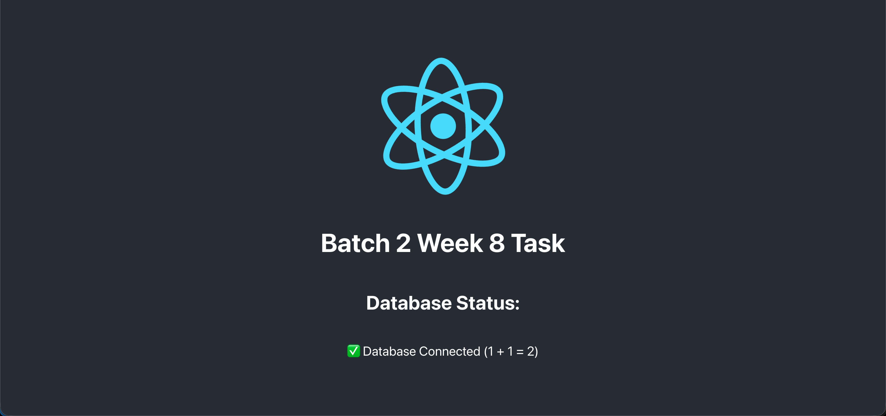

# Batch 2 Week 8 Task

## Task Instructions

### 1️⃣ Create a Dockerfile for the Backend

- Location: `./backend/Dockerfile`
- Runs on port `4000`
- Use a **single-stage build**
- Base image: `node:20-alpine` (or similar)
- Steps:
  - To install the dependencies, run `npm install`
  - To run the application, run `npm run start`

### 2️⃣ Create a Dockerfile for the Frontend

- Location: `./frontend/Dockerfile`
- Runs on port `3000`
- Base image: `node:20-alpine` (or similar)
- Steps:
  - To install the dependencies, run `npm install`
  - To build the application, run `npm run build`
  - To run the application, run `npm run start`

- Multi-stage build is **optional but recommended**
- Recommended setup:
  - **Stage 1 (Builder)**:
    - Base image: `node:20-alpine`
    - Build the app using `npm run build`
  - **Stage 2 (Nginx)**:
    - Base image: `nginx:alpine`
    - Copy the build output to `/usr/share/nginx/html`
    - Optionally add a custom `nginx.conf` to proxy `/api` to the backend
- Expose port `80` (Only for nginx)

### 3️⃣ Create a `docker-compose.yml` File

- Location: `./docker-compose.yml`
- Define the following services:
  - `frontend`
  - `backend`
  - `db`
- `frontend` should depend on `backend`
- `backend` should depend on `db`
- `db` should use the `mysql:8` image
- `db` should have the following environment variables:
  - `MYSQL_ROOT_PASSWORD: rootpass`
  - `MYSQL_DATABASE: app_db`
  - `MYSQL_USER: app_user`
  - `MYSQL_PASSWORD: app_pass`

### 4️⃣ Run the Application

- Run `docker-compose up --build`
- Access the application at `http://localhost:8080`

### 5️⃣ Expected Output

- The frontend should display whether the backend can connect to the database
- The backend should expose a `/api/db-check` endpoint
- The MySQL database should be running

### 6️⃣ Submission

- Submit the following files:
  - `./backend/Dockerfile`
  - `./frontend/Dockerfile`
  - `./docker-compose.yml`
  - `./frontend/nginx.conf` (if you created it)
  - Screenshot of the running application
### 7️⃣ Output Screenshot

